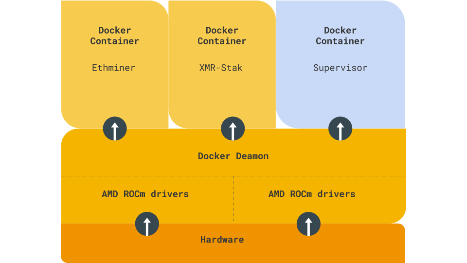

# Barracuda

This is a work in progress. More details coming soon...

## Mission Statement

The purpose of this project is to:
1. Provide a simple and repeatable pattern for provisioning multi-GPU Linux hosts with common set of runtime dependencies for executing crypto-currency mining applications.
2. Establish a common pattern and interface, i.e. via Docker images, that enables the deployment and execution of mining applications at scale efficiently and reliably.

## Architecture

## Using Barracuda Today

In the meantime, please make use of the [Ubuntu 16.04 Setup Guide (NVIDIA)](doc/Ubuntu-16.04-Setup-NVIDIA.md) and the [Ethminer Docker Image](src/docker-ethminer/README.md).

## Contributing

Contributing guide coming soon...
